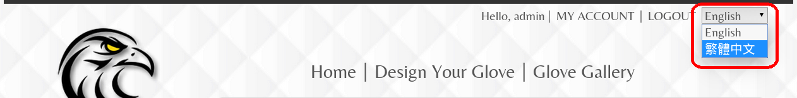

# SOKO Glove Configurator
此專案是替全球知名棒壘球品牌「SOKO」，所開發的手套即時線上客製化設計與訂購系統。以 HTML5 Canvas
技術實現了即時繪圖並顯示手套設計結果之功能，能讓顧客自由的設計其理想配色與樣貌的棒壘球手套。該專案亦涵蓋了Gallery、個人收藏設計、完整的後台等部份，並且全站支援中英雙語系。

* 使用技術：HTML5 Canvas、Bootstrap、jQuery、SASS、Laravel、MySQL

* 開發團隊：CodeStorm (周昱安、黃駿朋)

* 系統正式上線營運中的連結：http://gc.sokosports.com/

* 關於專案的安裝，請見[安裝](./install.html)章節

* 可於頁面最右上角的下拉式選單切換中 / 英文語系

#### 注意：
##### 本專案版權為 [SOKO Sports](http://sokosports.com) 所有，原始碼經 [SOKO Sports](http://sokosports.com) 同意並授權後僅作為周昱安、黃駿朋之研究所推甄備審資料之用，請勿轉作其他用途，謝謝！
