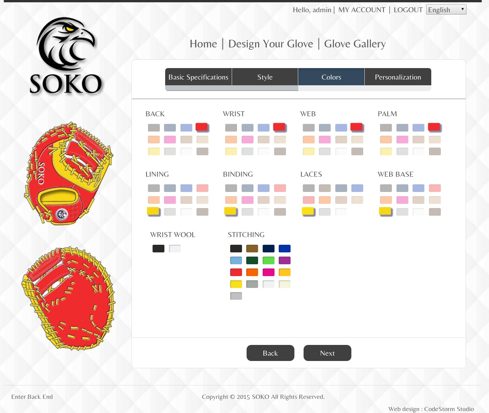

# 手套設計 (Glove Desgin)
本功能為此專案最重要的一個部份，也就是手套即時線上客製化設計系統，讓使用者能夠即時的選擇想要的手套尺寸、大小、皮革、部位顏色、客製化商標與名字的刺繡...等等，並且以 HTML5 Canvas 技術來進行的繪圖運算，即時的呈現給使用者。

## 基本規格
可以設定手套的一些基本規格，例如像是慣用手、皮革、守備位置、尺寸...等等。

## 樣式
設定手套的樣式設計，例如手背款式、手指保護套、球檔風格...等等。

## 顏色
設計手套各部位的顏色，並進行即時渲染顯示。

## 個人化設定
### 腕帶商標顏色 & 個人化商標

### 個人化名字、號碼

### 國旗 & 額外需求敘述

## 總結與其他操作
本畫面可以針對剛進行完的設計進行一些操作，包括像是分享網址，收藏到自己的收藏列表中，投稿到手套設計庫中，以及結帳購買。

其中投稿必須由管理員從後台進行審核通過之後，這個設計才會被上架到手套設計庫中。

