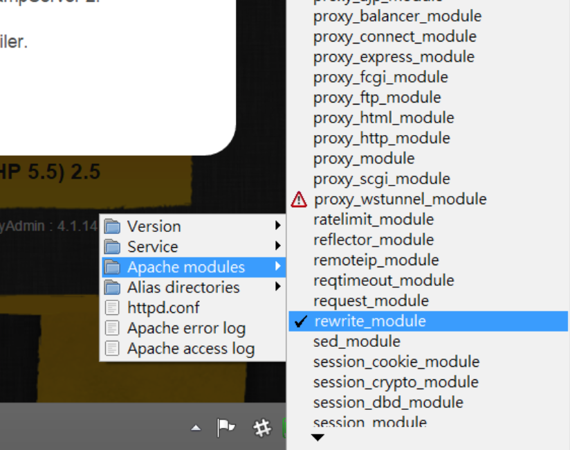

# 安裝

## 環境基本需求
本專案基於 Laravel 4 & MySQL 開發，有一些系統環境需求：
* PHP >= 5.4
* MCrypt PHP 套件

PHP 5.5 之後，一些作業系統需要手動安裝 PHP JSON 套件。如果你使用的是 Ubuntu，可以透過 apt-get install php5-json 來直接安裝。

* [Laravel 4 官方文件](http://laravel.tw/docs/4.2/installation)
#### 網站的根目錄請指向專案根目錄底下的 public 資料夾。

我們推薦你使用 WAMPP 這種整合包進行快速的環境建置，在 Windows 上使用，當然，你也可以自己手動建立這些環境。

* [WAMPP 下載地址](http://nchc.dl.sourceforge.net/project/wampserver/WampServer%202/Wampserver%202.5/wampserver2.5-Apache-2.4.9-Mysql-5.6.17-php5.5.12-64b.exe)

* 需要開啟 Apache 的 rewrite_module
  


## 資料庫設定
### 資料庫匯入
將專案根目錄中附帶的`database.sql`匯入你的本機 MySQL 資料庫中。

### 資料庫連線設定
開啟 `app/config/database.php`，找到以下程式碼區塊，並改成適用於你本機的 MySQL 連線設定：
```
'mysql' => array(
  'driver'    => 'mysql',
  'host'      => 'localhost',
  'database'  => 'dev',
  'username'  => 'root',
  'password'  => '123456',
  'charset'   => 'utf8',
  'collation' => 'utf8_unicode_ci',
  'prefix'    => '',
),
```
